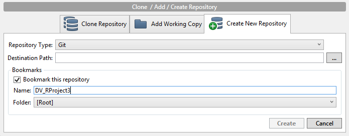
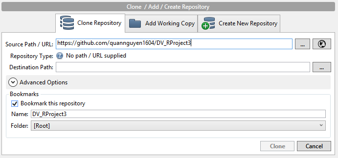
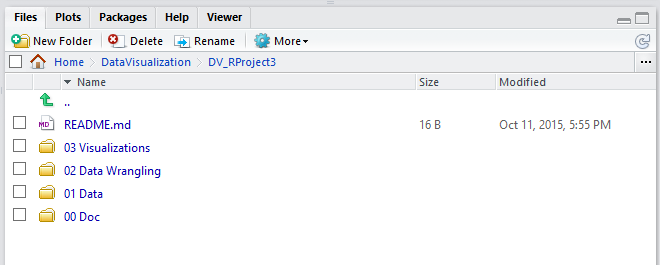
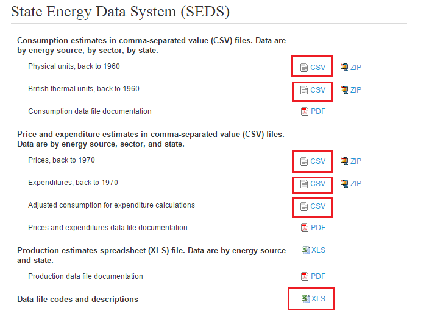
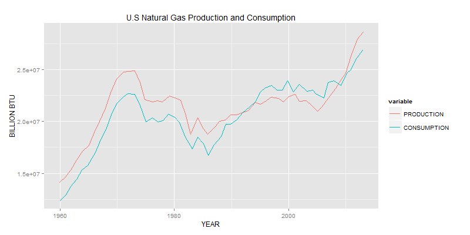
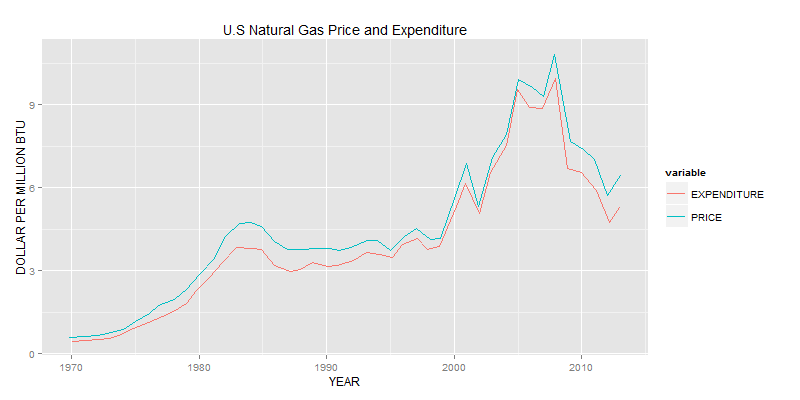
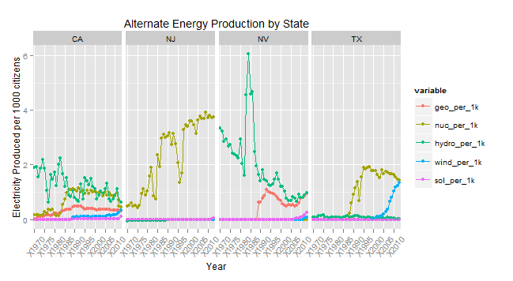

 

## 00. Create/Clone a github repository
Go to SourceTree software. Create new git repository in DataVisualization folder (on same level as DrCannata folder).


If did not create the repo, clone the repo in SourceTree software.


## 01. Create RStudio Project
Create an RStudio project in the project folder.  


## 02. Setup RStudio 
 Create three folders in RStudio Project:  
   **00 Doc**: where .Rmd and graphics folder lives  
   **01 Data**: where data will be stored  
   **02 DataWrangling**: where data is explored in ggplot  
   **03 Visualizations**: Where visualizations are saved  
   
   


## 03. Download .CSV Files

Download csv files for energy consumption, prices, expenditures, and data codes for energy consumption in the United States. All files downloaded as .xlxs were converted into .csv files.  

Downloaded from: http://www.eia.gov/tools/models/timeseries.cfm  



## 04. ETL

```{R eval=FALSE}
require(tidyr)
require(dplyr)
require(ggplot2)

setwd("~/DataVisualization/DV_RProject3/CSVs/")

files <- list("ex_all", "MSNCodes", "pr_adjust_consum", "pr_all", "Prod_dataset", "use_all_btu", "use_all_phy")

# change index number for each file
file_path <- paste(files[0], '.csv', sep='')

df <- read.csv(file_path, stringsAsFactors = FALSE)


# Replace "." (i.e., period) with "_" in the column names.
names(df) <- gsub("\\.+", "_", names(df))

str(df) # Uncomment this and  run just the lines to here to get column types to use for getting the list of measures.


measures <- c()

#for (i in 1970:2013) #uncomment for prices and expenditures
#for (i in 1960:2013) #uncomment for production_data and usage

#  { measures <- c(measures, paste('x',toString(i), sep = '')) }

#measures <- NA # uncomment for MSN_Codes


# Get rid of special characters in each column.
# Google ASCII Table to understand the following:
for(n in names(df)) {
  df[n] <- data.frame(lapply(df[n], gsub, pattern="[^ -~]",replacement= ""))
}


dimensions <- setdiff(names(df), measures)
if( length(measures) > 1 || ! is.na(dimensions)) {
  for(d in dimensions) {
    # Get rid of " and ' in dimensions.
    df[d] <- data.frame(lapply(df[d], gsub, pattern="[\"']",replacement= ""))
    # Change & to and in dimensions.
    df[d] <- data.frame(lapply(df[d], gsub, pattern="&",replacement= " and "))
    # Change : to ; in dimensions.
    df[d] <- data.frame(lapply(df[d], gsub, pattern=":",replacement= ";"))
  }
}

library(lubridate)
# Fix date columns, this needs to be done by hand because | needs to be correct.
#                                                        \_/
df$Order_Date <- gsub(" [0-9]+:.*", "", gsub(" UTC", "", mdy(as.character(df$Order_Date), tz="UTC")))
df$Ship_Date  <- gsub(" [0-9]+:.*", "", gsub(" UTC", "", mdy(as.character(df$Ship_Date),  tz="UTC")))

# The following is an example of dealing with special cases like making state abbreviations be all upper case.
# df["State"] <- data.frame(lapply(df["State"], toupper))

# Get rid of all characters in measures except for numbers, the - sign, and period.dimensions
if( length(measures) > 1 || ! is.na(measures)) {
  for(m in measures) {
    df[m] <- data.frame(lapply(df[m], gsub, pattern="[^--.0-9]",replacement= ""))
  }
}

write.csv(df, paste(gsub(".csv", "", file_path), ".reformatted.csv", sep=""), row.names=FALSE, na = "")

tableName <- gsub(" +", "_", gsub("[^A-z, 0-9, ]", "", gsub(".csv", "", file_path)))
sql <- paste("CREATE TABLE", tableName, "(\n-- Change table_name to the table name you want.\n")
if( length(measures) > 1 || ! is.na(dimensions)) {
  for(d in dimensions) {
    sql <- paste(sql, paste(d, "varchar2(4000),\n"))
  }
}
if( length(measures) > 1 || ! is.na(measures)) {
  for(m in measures) {
    if(m != tail(measures, n=1)) sql <- paste(sql, paste(m, "number(38,4),\n"))
    else sql <- paste(sql, paste(m, "number(38,4)\n"))
  }
}
sql <- paste(sql, ");")
cat(sql)
```

## 05. Summary and Subset

Since we have 7 CSV files in total, we will only create one dataframe from one of the data tables on Oracle for demonstration: Energy Price of 50 states and D.C. OVer the Years.

### Summary of Dataframe

Creating dataframe from Oracle's database with SQL query:

```{r, warning = FALSE}
require("jsonlite")
require("RCurl")
dframe <- data.frame(fromJSON(getURL(URLencode('129.152.144.84:5001/rest/native/?query="select * from energy_prices"'),httpheader=c(DB='jdbc:oracle:thin:@129.152.144.84:1521/PDBF15DV.usuniversi01134.oraclecloud.internal', USER='cs329e_cjs2599', PASS='orcl_cjs2599', MODE='native_mode', MODEL='model', returnDimensions = 'False', returnFor = 'JSON'), verbose = TRUE), ))
```

```{r}
summary(dframe)
```  

### Subset of Dataframe

Energy Price at Texas, a subset of the Energy Price dataframe:

```{r, warning = FALSE}
head(subset(dframe, STATE == "TX"))
```

## 06. Visualizations  

### Visualization 1: Price Efficiency Across Sectors

```{R, echo = FALSE, warning = FALSE}
require(dplyr)
require(tidyr)
require(ggplot2)
require(jsonlite)
require(RCurl)
require(stringr)

dfexpend <- data.frame(fromJSON(getURL(URLencode('129.152.144.84:5001/rest/native/?query="select * from ENERGY_EXPENDITURES;"'),httpheader=c(DB='jdbc:oracle:thin:@129.152.144.84:1521/PDBF15DV.usuniversi01134.oraclecloud.internal', USER='cs329e_cjs2599', PASS='orcl_cjs2599', MODE='native_mode', MODEL='model', returnDimensions = 'False', returnFor = 'JSON'), verbose = TRUE), ))

dfprice <- data.frame(fromJSON(getURL(URLencode('129.152.144.84:5001/rest/native/?query="select * from ENERGY_PRICES;"'),httpheader=c(DB='jdbc:oracle:thin:@129.152.144.84:1521/PDBF15DV.usuniversi01134.oraclecloud.internal', USER='cs329e_cjs2599', PASS='orcl_cjs2599', MODE='native_mode', MODEL='model', returnDimensions = 'False', returnFor = 'JSON'), verbose = TRUE), ))

MSN_ref <- data.frame(fromJSON(getURL(URLencode('129.152.144.84:5001/rest/native/?query="select * from ENERGY_MSN_LOOKUP;"'),httpheader=c(DB='jdbc:oracle:thin:@129.152.144.84:1521/PDBF15DV.usuniversi01134.oraclecloud.internal', USER='cs329e_cjs2599', PASS='orcl_cjs2599', MODE='native_mode', MODEL='model', returnDimensions = 'False', returnFor = 'JSON'), verbose = TRUE), ))

# Find general Energy Type labels from MSN reference table
MSN_ref %>% filter(UNIT != "Percent Share") %>% mutate(energy_label = word(DESCRIPTION,1)) %>% mutate(msn_short = substr(MSN, 0, 2)) %>% melt(id="energy_label") %>% rename(MSN = value) -> MSN_ref

# create unique row ids by concatenating State and MSN code
# pop last char of MSN, which codes for unit of measure, to obtain matching MSNs across expenditure and price
dfexpend %>% mutate(row_id = paste(STATE, '_', substr(MSN, 0, 4), sep='')) -> dfexpend
dfprice %>% mutate(row_id = paste(STATE, '_', substr(MSN, 0, 4), sep='')) -> dfprice

# melt data down so year is variable, not column name
newex <- dfexpend %>% select(-DATA_STATUS) %>% melt(., id=c('row_id','STATE','MSN')) %>% rename(year = variable) %>% rename(expenditure = value)
newpr <- dfprice %>% select(-DATA_STATUS) %>% melt(., id=c('row_id','STATE','MSN')) %>% rename(year = variable) %>% rename(price = value)

# append energy labels to newex
left_join(newex, MSN_ref, by=("MSN")) %>% select(-variable) -> newex

# join expenses and prices
dplyr::full_join(newex, newpr, by=c("row_id","year","STATE")) -> prex
prex %>% mutate(year = substr(year, 2, 5)) %>% mutate(energy_type = substr(MSN.x, 0, 3)) -> prex


prex %>% filter(STATE != "US") %>% filter(energy_label != "All") %>% filter(energy_label != "Total") %>% filter(energy_label != "Primary") %>% filter(price < 1000000) %>% filter(expenditure < 100000) %>% ggplot(aes(x=as.numeric(expenditure), y =as.numeric(price), color=as.numeric(year))) + geom_point() + facet_wrap(~energy_label) + labs(x="Expenditures", y="Price") + labs(title="Price to Expenditure Ratio By Energy Sector") + theme(axis.text.x = element_text(angle = 90, hjust = 1))

```

- This graph shows broadly the relationship between cost to the producer and cost to the consumer of energy prices, and how this relationship differs across sectors.

- Electricity and Motor Fuel have far and away the most consistently high cost-to-price ratio, but in recent years natural gas, asphalt, distillate, and petrochemical have shown high ratios as well

- Lubricants, Aviation fuel, Kerosene, Waxes, and Wood show an astoundingly low cost-to-price ratio, indicating that profit margins are far higher than average for the companies that produce them (compared, at least, to other energy sectors)

- Interestingly, nuclear energy has had astoundingly low costs and prices since it (relatively recently) began being recorded. For the interest of both the consumer and the producer, this makes a compelling argument for the propagation or nuclear energy.

### Visualization 2: U.S. Natural Gas Data

Description:

- My visualization looks at data for natural gas for the whole U.S., comparing production versus consumption, and price versus expenditure.

- Since price is in dollars per unit gas while expenditure is in total dollars for each year, I had to convert them into the same unit by dividing expenditure with gas production at each year.

```{r, eval=FALSE}
require(tidyr)
require(dplyr)
require(ggplot2)
require(reshape2)
require("jsonlite")
require("RCurl")

allProd <- data.frame(fromJSON(getURL(URLencode('129.152.144.84:5001/rest/native/?query="select * from energy_production_data;"'),httpheader=c(DB='jdbc:oracle:thin:@129.152.144.84:1521/PDBF15DV.usuniversi01134.oraclecloud.internal', USER='cs329e_cjs2599', PASS='orcl_cjs2599', MODE='native_mode', MODEL='model', returnDimensions = 'False', returnFor = 'JSON'), verbose = TRUE), ))

allUse <- data.frame(fromJSON(getURL(URLencode('129.152.144.84:5001/rest/native/?query="select * from energy_usage_btu;"'),httpheader=c(DB='jdbc:oracle:thin:@129.152.144.84:1521/PDBF15DV.usuniversi01134.oraclecloud.internal', USER='cs329e_cjs2599', PASS='orcl_cjs2599', MODE='native_mode', MODEL='model', returnDimensions = 'False', returnFor = 'JSON'), verbose = TRUE), ))

allExpend <- data.frame(fromJSON(getURL(URLencode('129.152.144.84:5001/rest/native/?query="select * from energy_expenditures;"'),httpheader=c(DB='jdbc:oracle:thin:@129.152.144.84:1521/PDBF15DV.usuniversi01134.oraclecloud.internal', USER='cs329e_cjs2599', PASS='orcl_cjs2599', MODE='native_mode', MODEL='model', returnDimensions = 'False', returnFor = 'JSON'), verbose = TRUE), ))

allPrices <- data.frame(fromJSON(getURL(URLencode('129.152.144.84:5001/rest/native/?query="select * from energy_prices;"'),httpheader=c(DB='jdbc:oracle:thin:@129.152.144.84:1521/PDBF15DV.usuniversi01134.oraclecloud.internal', USER='cs329e_cjs2599', PASS='orcl_cjs2599', MODE='native_mode', MODEL='model', returnDimensions = 'False', returnFor = 'JSON'), verbose = TRUE), ))

qdf1 <- allProd %>% rename(., STATE = STATECODE) %>% filter (MSN == "NGMPB", STATE == "US") %>% select (-DATA_STATUS, -STATE) %>% melt(., id = "MSN") %>% select(-MSN) %>% rename(., YEAR = variable, PRODUCTION = value)

qdf2 <- allUse %>% filter (MSN == "NGTCB", STATE == "US") %>% select (-DATA_STATUS, -STATE) %>% melt(., id = "MSN") %>% select(-MSN) %>% rename(., YEAR = variable, CONSUMPTION = value)

qdf3 <- inner_join(qdf1, qdf2, "YEAR") %>% sapply(.,gsub,pattern="X",replacement="") %>% data.frame(.) %>% melt(., id="YEAR")

p1 <- ggplot() + 
  coord_cartesian() + 
  scale_x_continuous() +
  scale_y_continuous() +
  labs(title='U.S Natural Gas Production and Consumption') +
  labs(x="YEAR", y="BILLION BTU") +
  layer(data=qdf3, 
        mapping=aes(x= as.numeric(as.character(YEAR)), y=as.numeric(as.character(value)), color=variable), 
        stat="identity", 
        stat_params=list(), 
        geom="line",
        geom_params=list(),
        geom_line(aes(group = variable)),
        position=position_jitter(width=0.2, height=0)
  )

qdf4 <- allPrices %>% filter (MSN == "NGTCD", STATE == "US") %>% select (-DATA_STATUS, -STATE) %>% melt(., id = "MSN") %>% select(-MSN) %>% rename(., YEAR = variable, PRICE = value)

qdf5 <- allExpend %>% filter (MSN == "NGTCV", STATE == "US") %>% select (-DATA_STATUS, -STATE) %>% melt(., id = "MSN") %>% select(-MSN) %>% rename(., YEAR = variable, EXPEND = value) %>% inner_join(., qdf1, "YEAR") %>% mutate(EXPENDITURE =  1000*as.numeric(EXPEND)/as.numeric(PRODUCTION)) %>% select (-EXPEND, -PRODUCTION) %>% inner_join(., qdf4, "YEAR") %>% sapply(.,gsub,pattern="X",replacement="") %>% data.frame(.) %>% melt(., id="YEAR")

p2 <- ggplot() + 
  coord_cartesian() + 
  scale_x_continuous() +
  scale_y_continuous() +
  labs(title='U.S Natural Gas Price and Expenditure') +
  labs(x="YEAR", y="DOLLAR PER MILLION BTU") +
  layer(data=qdf5, 
        mapping=aes(x= as.numeric(as.character(YEAR)), y=as.numeric(as.character(value)), color=variable), 
        stat="identity", 
        stat_params=list(), 
        geom="line",
        geom_params=list(),
        geom_line(aes(group = variable)),
        position=position_jitter(width=0.2, height=0)
  )
p1
p2
```





Comments:

- In the first plot, U.S. Natural Gas Production and Consumption over Year, the interesting point is that, during the period 1995-2009, consumption was actually higher than production. This indicates that the U.S. must have had to import natural gas from international market.

- The second plot, U.S. Natural Gas Price and Expenditure, partially explains the situation. We can easily notice that, roughly during the same period, the cost to produce one unit of natural gas climbed up dramatically compared to earlier years. This usually results in production slowdown, which explains why consumption overtook production in this period. Also notice that the profit margin (difference between price and expenditure) was particularly thin during this time.

### Visualization 3: Alternative Energy Consumption Across States  

-The goal of this visualization is to explore the consumption of alternative energy across different states. I would have prefered to look at the production of alternative energy, but unfortunatly this data was excluded from the CSV files we used, so I must instead use consumption to infer similar conclusions. I am aware this is not the optimal method, but it's the best that I have.  
-In order to better compare across states, I divided the net energy consumed of each generator (nuclear, hydro, solar, geothermal, and wind) by the population of the state. My reasoning is simple: larger states will clearly consume more energy, thus making it difficult to compare the efforts of large and small states are making towards alternative energy sources. Each data point is therefor "the energy generated by X that was consumed per one-thousand citizens", where X is the alternate energy source.  
-Of the 50 states to chose from, I seleted four that I think would yield interesting results: California because of its considerable resources and prograssive political stance, Nevada because it is the home of the Hoover Dam, Texas because it the power production giant of the United States, and New Jersy because I wanted to look at a state on the East Coast.   

  

####Solar/Wind  
-There are a few interesting things that we can take away from a (very shallow) glance at this visualization. Firstly, we can see that solar energy is an almost complete non-contributor for any of these states energy sources, with the exception of Nevanda in recent years. Another interesting trend is wind-power. California has been utilizing wind power since the early 1980's, but has not seen a rapid increase. Texas, on the other hand, has seen a huge increase in its wind-power consumption in recent years, and now produces the most (raw) wind power out of all the States.

####Hydroelectricity  
-A source of great interest in Nevada is the the Hoover Dam. The spike in consumption in 1984 we see on the graph could quite possible be attributed to the record rainfalls that Nevade experience in that year. Four of the wettest months in Nevada's recent history fell within 1984. More rain means more water for the dam to use to generate energy, which possibly could explain the huge peak we see. Another interesting observation is that hydoelectric power appears to be decreasing across all states. However, this could simply be that you cannot "buy" more water to produce electricity. If you have a drought (which californa/nevada have been having over the last couple decades), then you simply cannot produce as much water. Additionally, as the population increasaes, if the hydroelectric powerplants cannot keep up with production, then our ratio with deacrease.  

####Geothermal  
-In 1983, Nevada signed into effect a agreement to focus on using geothermal energy as an alternative source for electricity. This explains the drastic increase during that year. Of note is that the curves for geothermal and hydroelectric energy consumed in Nevama show a similar pattern. Could it be that the government stopped funding alternative energy sources for a while, and has recently, under a more liberal federal government, been receiving more incentive to increase prodcution once again?

####Nuclear  
-Lastly, a supprising discovery I made from this visualization is that New Jersey consumed a huge amount of nuclear energy compared to the other states shown here. Even more interesting is that we can track the consumption of nuclear energy to nuclear disasters that occure in these states! In 1983, a year at the start of the first big dip in NJ's consumption, The Oyster Creek Generating Station failed a safety inspection and was forced to close down. In 1993, a New York power station had to be shut down due, which probably starts the large decrease of nuclear consumption in NJ, its neighbohring state. This combined with a leak in reactor in 1995, the year before the lower point on our graph, probably contributed to this huge valley in consumption. 


-Here is the code for my Visualization. It is quite long because the CSV's were set up in a very inconvienient way, where every single year was its own colomn, and the data you were looking at could only be identified by the MSN tag in each row. 

```{R}
require(dplyr)
require(tidyr)
require(ggplot2)
require(jsonlite)
require(reshape2)

energy_pricesDF <- data.frame(fromJSON(getURL(URLencode('129.152.144.84:5001/rest/native/?query="select * from energy_prices WHERE x1960 >= -100000000;"'),httpheader=c(DB='jdbc:oracle:thin:@129.152.144.84:1521/PDBF15DV.usuniversi01134.oraclecloud.internal', USER='cs329e_cjs2599', PASS='orcl_cjs2599', MODE='native_mode', MODEL='model', returnDimensions = 'False', returnFor = 'JSON'), verbose = TRUE), ))

energy_usage_phyDF <- data.frame(fromJSON(getURL(URLencode('129.152.144.84:5001/rest/native/?query="select * from energy_usage_phy WHERE X1960 >= 0;"'),httpheader=c(DB='jdbc:oracle:thin:@129.152.144.84:1521/PDBF15DV.usuniversi01134.oraclecloud.internal', USER='cs329e_cjs2599', PASS='orcl_cjs2599', MODE='native_mode', MODEL='model', returnDimensions = 'False', returnFor = 'JSON'), verbose = TRUE), ))

# first we Want to filter by state from the consumption dataset, and by MSN code for hydroelectric, nuclear, geothermal, and solar electricity generated, as well as total population. 
altEnergyDF <- energy_usage_phyDF %>% filter (STATE %in% c("TX", "NV", "CA", "NJ"), MSN %in% c("HYEGP", "NUEGP", "GEEGP", "SOEGP","TPOPP", "WYEGP")) %>% arrange(STATE)


#Filter out the states we're interested in from the price dataset, as well as the (unadjusted) price for electricity in these states, including residential electricity and electricty for all uses (comercial, industrial, etc etc).
priceDF <- energy_pricesDF %>% filter (STATE %in% c("TX", "NV", "CA", "NJ"), MSN %in% c("ESTCD", "ESRCD"))


#Do a row bind (not a col join, our data is weird and the unique variables were placed in the rows, not the colomns) to combine these two data sets.
df_altEnergy <- dplyr::bind_rows(priceDF, altEnergyDF)

#Create each state's new datasheet. 
CA_energy <- df_altEnergy %>% filter (STATE == "CA") %>% select (-DATA_STATUS, -STATE)

TX_energy <- df_altEnergy %>% filter (STATE == "TX") %>% select (-DATA_STATUS, -STATE)
  
NV_energy <- df_altEnergy %>% filter (STATE == "NV") %>% select (-DATA_STATUS, -STATE)
  
NJ_energy <- df_altEnergy %>% filter (STATE == "NJ") %>% select (-DATA_STATUS, -STATE)


#transforming and joining the appropriate dataframes into the needed form so that we can plot against time

#make cols for price using melt
CA_price <- CA_energy %>% filter (MSN == "ESRCD")
CA_price <- melt(CA_price, id = "MSN")
CA_price <- rename(CA_price, ESRCD = value)
CA_price <- rename(CA_price, YEAR = variable)
CA_price <- data.frame(CA_price) %>% select(YEAR, ESRCD)

TX_price <- TX_energy %>% filter (MSN == "ESRCD")
TX_price <- melt(TX_price, id = "MSN")
TX_price <- rename(TX_price, ESRCD = value)
TX_price <- rename(TX_price, YEAR = variable)
TX_price <- data.frame(TX_price) %>% select(YEAR, ESRCD)

NV_price <- NV_energy %>% filter (MSN == "ESRCD")
NV_price <- melt(NV_price, id = "MSN")
NV_price <- rename(NV_price, ESRCD = value)
NV_price <- rename(NV_price, YEAR = variable)
NV_price <- data.frame(NV_price) %>% select(YEAR, ESRCD)

NJ_price <- NJ_energy %>% filter (MSN == "ESRCD")
NJ_price <- melt(NJ_price, id = "MSN")
NJ_price <- rename(NJ_price, ESRCD = value)
NJ_price <- rename(NJ_price, YEAR = variable)
NJ_price <- data.frame(NJ_price) %>% select(YEAR, ESRCD)

#make cols for geothermal production using melt
CA_geo <- CA_energy %>% filter (MSN == "GEEGP")
CA_geo <- melt(CA_geo, id = "MSN")
CA_geo <- rename(CA_geo, GEEGP = value)
CA_geo <- rename(CA_geo, YEAR = variable)
CA_geo <- data.frame(CA_geo) %>% select(YEAR, GEEGP)

TX_geo <- TX_energy %>% filter (MSN == "GEEGP")
TX_geo <- melt(TX_geo, id = "MSN")
TX_geo <- rename(TX_geo, GEEGP = value)
TX_geo <- rename(TX_geo, YEAR = variable)
TX_geo <- data.frame(TX_geo) %>% select(YEAR, GEEGP)

NV_geo <- NV_energy %>% filter (MSN == "GEEGP")
NV_geo <- melt(NV_geo, id = "MSN")
NV_geo <- rename(NV_geo, GEEGP = value)
NV_geo <- rename(NV_geo, YEAR = variable)
NV_geo <- data.frame(NV_geo) %>% select(YEAR, GEEGP)

NJ_geo <- NJ_energy %>% filter (MSN == "GEEGP")
NJ_geo <- melt(NJ_geo, id = "MSN")
NJ_geo <- rename(NJ_geo, GEEGP = value)
NJ_geo <- rename(NJ_geo, YEAR = variable)
NJ_geo <- data.frame(NJ_geo) %>% select(YEAR, GEEGP)

#make cols for hydroelectricity production using melt
CA_hy <- CA_energy %>% filter (MSN == "HYEGP")
CA_hy <- melt(CA_hy, id = "MSN")
CA_hy <- rename(CA_hy, HYEGP = value)
CA_hy <- rename(CA_hy, YEAR = variable)
CA_hy <- data.frame(CA_hy) %>% select(YEAR, HYEGP)

TX_hy <- TX_energy %>% filter (MSN == "HYEGP")
TX_hy <- melt(TX_hy, id = "MSN")
TX_hy <- rename(TX_hy, HYEGP = value)
TX_hy <- rename(TX_hy, YEAR = variable)
TX_hy <- data.frame(TX_hy) %>% select(YEAR, HYEGP)

NV_hy <- NV_energy %>% filter (MSN == "HYEGP")
NV_hy <- melt(NV_hy, id = "MSN")
NV_hy <- rename(NV_hy, HYEGP = value)
NV_hy <- rename(NV_hy, YEAR = variable)
NV_hy <- data.frame(NV_hy) %>% select(YEAR, HYEGP)

NJ_hy <- NJ_energy %>% filter (MSN == "HYEGP")
NJ_hy <- melt(NJ_hy, id = "MSN")
NJ_hy <- rename(NJ_hy, HYEGP = value)
NJ_hy <- rename(NJ_hy, YEAR = variable)
NJ_hy <- data.frame(NJ_hy) %>% select(YEAR, HYEGP)


# make cols for nuclear electricity production using melt
CA_nu <- CA_energy %>% filter (MSN == "NUEGP")
CA_nu <- melt(CA_nu, id = "MSN")
CA_nu <- rename(CA_nu, NUEGP = value)
CA_nu <- rename(CA_nu, YEAR = variable)
CA_nu <- data.frame(CA_nu) %>% select(YEAR, NUEGP)

TX_nu <- TX_energy %>% filter (MSN == "NUEGP")
TX_nu <- melt(TX_nu, id = "MSN")
TX_nu <- rename(TX_nu, NUEGP = value)
TX_nu <- rename(TX_nu, YEAR = variable)
TX_nu <- data.frame(TX_nu) %>% select(YEAR, NUEGP)

NV_nu <- NV_energy %>% filter (MSN == "NUEGP")
NV_nu <- melt(NV_nu, id = "MSN")
NV_nu <- rename(NV_nu, NUEGP = value)
NV_nu <- rename(NV_nu, YEAR = variable)
NV_nu <- data.frame(NV_nu) %>% select(YEAR, NUEGP)

NJ_nu <- NJ_energy %>% filter (MSN == "NUEGP")
NJ_nu <- melt(NJ_nu, id = "MSN")
NJ_nu <- rename(NJ_nu, NUEGP = value)
NJ_nu <- rename(NJ_nu, YEAR = variable)
NJ_nu <- data.frame(NJ_nu) %>% select(YEAR, NUEGP)

# make cols for solar electricity production using melt
CA_so <- CA_energy %>% filter (MSN == "SOEGP")
CA_so <- melt(CA_so, id = "MSN")
CA_so <- rename(CA_so, SOEGP = value)
CA_so <- rename(CA_so, YEAR = variable)
CA_so <- data.frame(CA_so) %>% select(YEAR, SOEGP)

TX_so <- TX_energy %>% filter (MSN == "SOEGP")
TX_so <- melt(TX_so, id = "MSN")
TX_so <- rename(TX_so, SOEGP = value)
TX_so <- rename(TX_so, YEAR = variable)
TX_so <- data.frame(TX_so) %>% select(YEAR, SOEGP)

NV_so <- NV_energy %>% filter (MSN == "SOEGP")
NV_so <- melt(NV_so, id = "MSN")
NV_so <- rename(NV_so, SOEGP = value)
NV_so <- rename(NV_so, YEAR = variable)
NV_so <- data.frame(NV_so) %>% select(YEAR, SOEGP)

NJ_so <- NJ_energy %>% filter (MSN == "SOEGP")
NJ_so <- melt(NJ_so, id = "MSN")
NJ_so <- rename(NJ_so, SOEGP = value)
NJ_so <- rename(NJ_so, YEAR = variable)
NJ_so <- data.frame(NJ_so) %>% select(YEAR, SOEGP)

# make cols for wind electricity production using melt
CA_wy <- CA_energy %>% filter (MSN == "WYEGP")
CA_wy <- melt(CA_wy, id = "MSN")
CA_wy <- rename(CA_wy, WYEGP = value)
CA_wy <- rename(CA_wy, YEAR = variable)
CA_wy <- data.frame(CA_wy) %>% select(YEAR, WYEGP)

TX_wy <- TX_energy %>% filter (MSN == "WYEGP")
TX_wy <- melt(TX_wy, id = "MSN")
TX_wy <- rename(TX_wy, WYEGP = value)
TX_wy <- rename(TX_wy, YEAR = variable)
TX_wy <- data.frame(TX_wy) %>% select(YEAR, WYEGP)

NV_wy <- NV_energy %>% filter (MSN == "WYEGP")
NV_wy <- melt(NV_wy, id = "MSN")
NV_wy <- rename(NV_wy, WYEGP = value)
NV_wy <- rename(NV_wy, YEAR = variable)
NV_wy <- data.frame(NV_wy) %>% select(YEAR, WYEGP)

NJ_wy <- NJ_energy %>% filter (MSN == "WYEGP")
NJ_wy <- melt(NJ_wy, id = "MSN")
NJ_wy <- rename(NJ_wy, WYEGP = value)
NJ_wy <- rename(NJ_wy, YEAR = variable)
NJ_wy <- data.frame(NJ_wy) %>% select(YEAR, WYEGP)

#make cols for total population using melt
CA_pop <- CA_energy %>% filter (MSN == "TPOPP")
CA_pop <- melt(CA_pop, id = "MSN")
CA_pop <- rename(CA_pop, TPOPP = value)
CA_pop <- rename(CA_pop, YEAR = variable)
CA_pop <- data.frame(CA_pop) %>% select(YEAR, TPOPP)

TX_pop <- TX_energy %>% filter (MSN == "TPOPP")
TX_pop <- melt(TX_pop, id = "MSN")
TX_pop <- rename(TX_pop, TPOPP = value)
TX_pop <- rename(TX_pop, YEAR = variable)
TX_pop <- data.frame(TX_pop) %>% select(YEAR, TPOPP)

NV_pop <- NV_energy %>% filter (MSN == "TPOPP")
NV_pop <- melt(NV_pop, id = "MSN")
NV_pop <- rename(NV_pop, TPOPP = value)
NV_pop <- rename(NV_pop, YEAR = variable)
NV_pop <- data.frame(NV_pop) %>% select(YEAR, TPOPP)

NJ_pop <- NJ_energy %>% filter (MSN == "TPOPP")
NJ_pop <- melt(NJ_pop, id = "MSN")
NJ_pop <- rename(NJ_pop, TPOPP = value)
NJ_pop <- rename(NJ_pop, YEAR = variable)
NJ_pop <- data.frame(NJ_pop) %>% select(YEAR, TPOPP)


#use full_join to aggregate into the full dataset.
CA_all <- dplyr::full_join(CA_price, CA_geo, "YEAR")
CA_all <- dplyr::full_join(CA_all, CA_hy, "YEAR")
CA_all <- dplyr::full_join(CA_all, CA_nu, "YEAR")
CA_all <- dplyr::full_join(CA_all, CA_so, "YEAR")
CA_all <- dplyr::full_join(CA_all, CA_wy, "YEAR")
CA_all <- dplyr::full_join(CA_all, CA_pop, "YEAR")

TX_all <- dplyr::full_join(TX_price, TX_geo, "YEAR")
TX_all <- dplyr::full_join(TX_all, TX_hy, "YEAR")
TX_all <- dplyr::full_join(TX_all, TX_nu, "YEAR")
TX_all <- dplyr::full_join(TX_all, TX_so, "YEAR")
TX_all <- dplyr::full_join(TX_all, TX_wy, "YEAR")
TX_all <- dplyr::full_join(TX_all, TX_pop, "YEAR")

NV_all <- dplyr::full_join(NV_price, NV_geo, "YEAR")
NV_all <- dplyr::full_join(NV_all, NV_hy, "YEAR")
NV_all <- dplyr::full_join(NV_all, NV_nu, "YEAR")
NV_all <- dplyr::full_join(NV_all, NV_so, "YEAR")
NV_all <- dplyr::full_join(NV_all, NV_wy, "YEAR")
NV_all <- dplyr::full_join(NV_all, NV_pop, "YEAR")

NJ_all <- dplyr::full_join(NJ_price, NJ_geo, "YEAR")
NJ_all <- dplyr::full_join(NJ_all, NJ_hy, "YEAR")
NJ_all <- dplyr::full_join(NJ_all, NJ_nu, "YEAR")
NJ_all <- dplyr::full_join(NJ_all, NJ_so, "YEAR")
NJ_all <- dplyr::full_join(NJ_all, NJ_wy, "YEAR")
NJ_all <- dplyr::full_join(NJ_all, NJ_pop, "YEAR")

#mutate in cols that account for population, want produciton per population.
CA_ratio <- CA_all %>% mutate(geo_per_1k =  (as.numeric(GEEGP)/as.numeric(TPOPP)), nuc_per_1k = as.numeric(NUEGP)/as.numeric(TPOPP), hydro_per_1k = as.numeric(HYEGP)/as.numeric(TPOPP), wind_per_1k = as.numeric(WYEGP)/as.numeric(TPOPP), sol_per_1k =as.numeric(SOEGP)/as.numeric(TPOPP), pop = as.numeric (TPOPP), price = as.numeric(ESRCD), year = as.character(YEAR)) %>% select(year, geo_per_1k, nuc_per_1k, hydro_per_1k, wind_per_1k, sol_per_1k)

TX_ratio <- TX_all %>% mutate(geo_per_1k =  (as.numeric(GEEGP)/as.numeric(TPOPP)), nuc_per_1k = as.numeric(NUEGP)/as.numeric(TPOPP), hydro_per_1k = as.numeric(HYEGP)/as.numeric(TPOPP), wind_per_1k = as.numeric(WYEGP)/as.numeric(TPOPP), sol_per_1k =as.numeric(SOEGP)/as.numeric(TPOPP), pop = as.numeric (TPOPP), price = as.numeric(ESRCD), year = as.character(YEAR)) %>% select(year, geo_per_1k, nuc_per_1k, hydro_per_1k, wind_per_1k, sol_per_1k)

NV_ratio <- NV_all %>% mutate(geo_per_1k =  (as.numeric(GEEGP)/as.numeric(TPOPP)), nuc_per_1k = as.numeric(NUEGP)/as.numeric(TPOPP), hydro_per_1k = as.numeric(HYEGP)/as.numeric(TPOPP), wind_per_1k = as.numeric(WYEGP)/as.numeric(TPOPP), sol_per_1k =as.numeric(SOEGP)/as.numeric(TPOPP), pop = as.numeric (TPOPP), price = as.numeric(ESRCD), year = as.character(YEAR)) %>% select(year, geo_per_1k, nuc_per_1k, hydro_per_1k, wind_per_1k, sol_per_1k)

NJ_ratio <- NJ_all %>% mutate(geo_per_1k =  (as.numeric(GEEGP)/as.numeric(TPOPP)), nuc_per_1k = as.numeric(NUEGP)/as.numeric(TPOPP), hydro_per_1k = as.numeric(HYEGP)/as.numeric(TPOPP), wind_per_1k = as.numeric(WYEGP)/as.numeric(TPOPP), sol_per_1k =as.numeric(SOEGP)/as.numeric(TPOPP), pop = as.numeric (TPOPP), price = as.numeric(ESRCD), year = as.character(YEAR)) %>% select(year, geo_per_1k, nuc_per_1k, hydro_per_1k, wind_per_1k, sol_per_1k)


# mutate in a STATE col so can differentiate
CA_ratio <- CA_ratio %>% arrange(year) %>% mutate (STATE = "CA")

TX_ratio <- TX_ratio %>% arrange(year) %>% mutate (STATE = "TX")

NV_ratio <- NV_ratio %>% arrange(year) %>% mutate (STATE = "NV")

NJ_ratio <- NJ_ratio %>% arrange(year) %>% mutate (STATE = "NJ")

#bind rows to create full dataframe to be graphed
graph_all <- CA_ratio
graph_all <- dplyr::bind_rows(graph_all, TX_ratio)
graph_all <- dplyr::bind_rows(graph_all, NV_ratio)
graph_all <- dplyr::bind_rows(graph_all, NJ_ratio)


#once again we melt in order to view multiple variables on one plot
graph <-  melt(graph_all, id.vars = c("year", "STATE"))


ggplot(graph, aes(y = value, x = year, color = variable)) +
  labs(title='Alternate Energy Production by State') +
  labs(x="Year", y=paste("Electricity Produced per 1000 citizens")) +
  facet_grid(~STATE)+
  geom_point() +
  geom_line(aes(group = variable)) +
  theme(axis.text.x=element_text(angle=50, size=7, vjust=0.5)) +
  scale_x_discrete(breaks = c("X1960", "X1965", "X1970", "X1975", "X1980", "X1985", "X1990", "X1995", "X2000", "X2005", "X2010"))
  coord_cartesian()
```

### The End
  